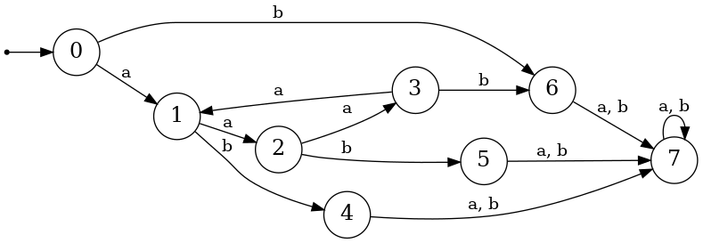

# ЗАВЕРШИМОСТЬ

Заметим, что в исходной системе есть цикл. Действительно: 

- $bababb \rightarrow bbabb$ (правило $ababb \rightarrow babb$)
- $bbabb \rightarrow baababb$ (правило $bba \rightarrow baaba$)
- $baababb \rightarrow bababb$ (правило $ababb \rightarrow babb$)

Поэтому система **НЕ ЗАВЕРШИМА**.  
Сделаем другую систему, которая будет завершимой. Для этого выберем фундированный порядок: 
- В случае, если длины строк различны, то считаем, что больший порядок имеет строка с большей длиной. 
- В случае, если длины строк совпадают, то больший порядок будет иметь строка, которая больше лексикографически.

В связи с выбранным порядком, изменим в двух правилах левую и правую часть:
$baaba \rightarrow bba$ и $baabb \rightarrow bbb$

# ЛОКАЛЬНАЯ КОНФЛЮЭНТНОСТЬ

Заметим, что локальная конфлюэнтность отсутствует. Действительно, рассмотрим строку $bbbaab$. К ней можно применить 2 правила:

- $bbba \rightarrow ba$ 
- $bbaab \rightarrow baa$

Если применяем правило $bbba \rightarrow ba$, то получаем строку $baab$. Заметим, что к ней больше нельзя применить никаких правил. Теперь применим правило $bbaab -> baa$. Получим строку $bbaa$. Заметим, что к ней больше нельзя применить никаких правил. Поэтому локальная конфлюэнтность отсутствует.  
Напишем код алгоритма пополнения Кнута-Бендикса. В итоге получим, что пополненная система содержит правила:

- $aaaa \rightarrow a$
- $aaab \rightarrow b$
- $bbba \rightarrow ba$
- $bbbb \rightarrow bb$
- $ababb \rightarrow babb$
- $baaba \rightarrow bba$
- $baabb \rightarrow bbb$
- $bbaaa \rightarrow baab$
- $bbaab \rightarrow baa$
- $bbabb \rightarrow abab$
- $baba \rightarrow baa$
- $babbaa \rightarrow babba$
- $babbab \rightarrow abb$
- $babba \rightarrow bb$
- $babb \rightarrow bab$
- $bab \rightarrow abb$
- $baaa \rightarrow abb$
- $abaa \rightarrow baa$
- $baa \rightarrow abb$
- $abbb \rightarrow abb$
- $abb \rightarrow bb$
- $bba \rightarrow bb$
- $bb \rightarrow ba$
- $aba \rightarrow ba$

# КОНЕЧНОСТЬ

Заметим, что в полученной системе будет 8 нормальных форм: 
$\varepsilon$, $a$, $b$, $aa$, $ab$, $ba$, $aaa$, $aab$  
К любой другой строке можно применить какое-то правило.
Построим автомат  

# МИНИМИЗАЦИЯ

Построим по автомату следующую таблицу:

|   | 0 | 1 | 2 | 3 | 4 | 5 | 6 | 7 |
|---|:---:|:--:|:--:|:--:|:--:|:--:|:--:|:--:|
| a | 1 | 2 | 3 | 1 | 7 | 7 | 7 | 7 |
| b | 6 | 4 | 5 | 6 | 7 | 7 | 7 | 7 |
| aa | 2 | 3 | 1 | 2 | 7 | 7 | 7 | 7 |
| ab | 4 | 5 | 6 | 7 | 7 | 7 | 7 | 7 |
| ba | 7 | 7 | 7 | 7 | 7 | 7 | 7 | 7 | 
| bb | 7 | 7 | 7 | 7 | 7 | 7 | 7 | 7 |
| aaa | 3 | 1 | 2 | 3 | 7 | 7 | 7 | 7 |
| aab | 5 | 6 | 4 | 5 | 7 | 7 | 7 | 7 |
| aba | 7 | 7 | 7 | 7 | 7 | 7 | 7 | 7 |
| abb | 7 | 7 | 7 | 7 | 7 | 7 | 7 | 7 |
| baa | 7 | 7 | 7 | 7 | 7 | 7 | 7 | 7 |
| bab | 7 | 7 | 7 | 7 | 7 | 7 | 7 | 7 |
| bba | 7 | 7 | 7 | 7 | 7 | 7 | 7 | 7 |
| bbb | 7 | 7 | 7 | 7 | 7 | 7 | 7 | 7 |
| aaaa | 1 | 2 | 3 | 1 | 7 | 7 | 7 | 7 |
| aaab | 6 | 4 | 5 | 6 | 7 | 7 | 7 | 7 | 

Используя таблицу, получаем, что минимальная система должна состоять из следующих правил:
- $bb \rightarrow ba$
- $aba \rightarrow ba$
- $baa \rightarrow ba$
- $bab \rightarrow ba$
- $aaaa \rightarrow a$
- $aaab \rightarrow b$

# ФАЗЗ-ТЕСТИРОВАНИЕ

Возьмём произвольную строку $s_1$ и в исходной системе $T$ применим к ней произвольную последовательность правил, получим строку $s_2$. Если в системе $T$ строки $s_1$ и $s_2$ сводятся к одной строке, то всё правильно.

# МЕТАМОРФНОЕ ТЕСТИРОВАНИЕ

Заметим, что в исходной системе $T$ есть такие инварианты:

1. Если в слове есть буква $b$, то при любом правиле в слове всё равно останется буква $b$.
   Тестирование показало, что этот инвариант также выполняется и в новой системе $T'$.

2. Число букв $b$ не увеличивается при каждом правиле в исходной системе.
   Тестирование показало, что этот инвариант выполняется в новой системе $T'$.

3. Пусть есть единичная матрица A размера 2 на 2 и матрица B = ((2 , -1) (2 , -1)), тогда если в строке заменить букву $a$ на матрицу A, букву $b$ на матрицу B и поставить между матрицами знаки умножить, то в исходной системе при применении любого правила результат умножения не изменится. Тестирование показало, что этот инвариант также выполняется и в новой системе $T'$.
